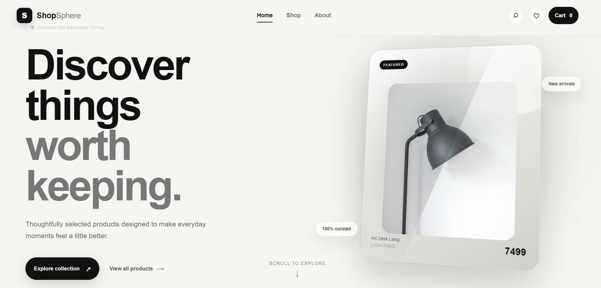
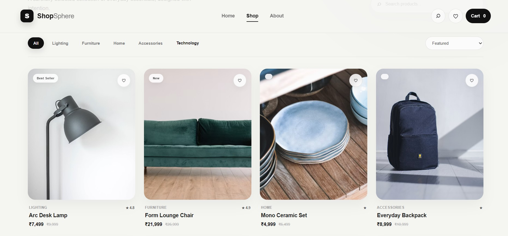
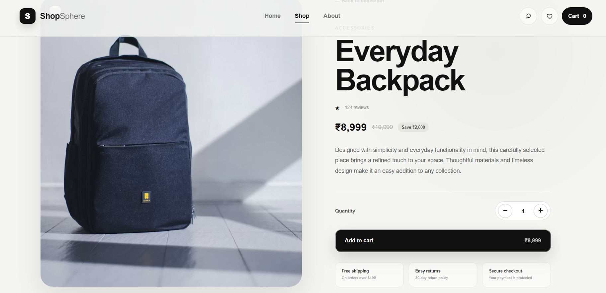
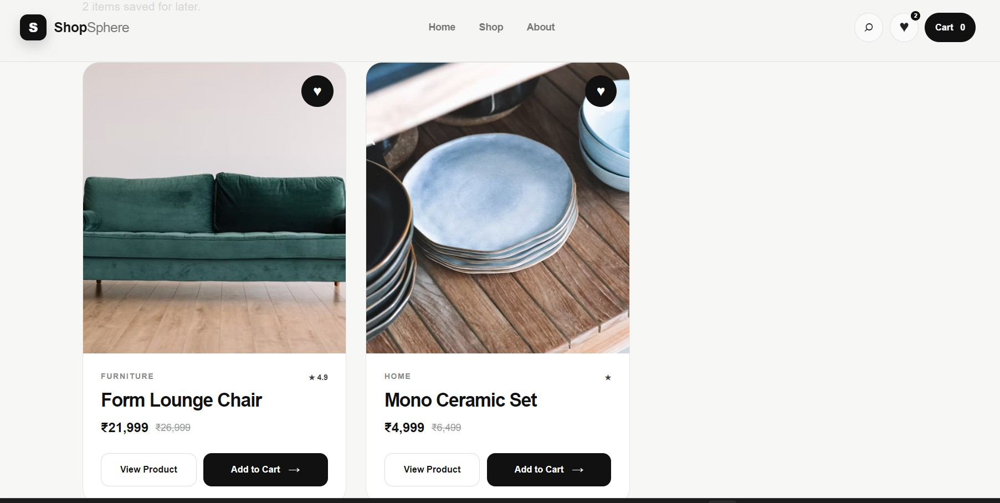
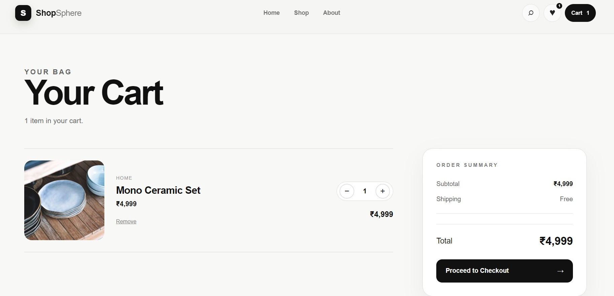
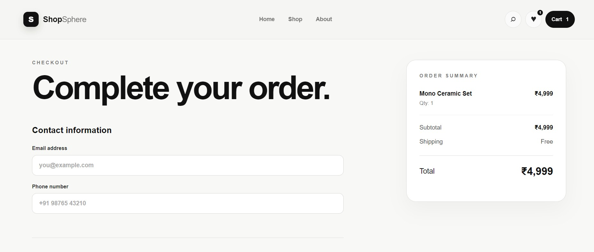

# 🛍️ ShopSphere

### Modern React E-Commerce Web Application

ShopSphere is a modern and responsive e-commerce web application built with **React.js and Vite**. It provides a clean shopping experience with product browsing, search, filtering, wishlist, cart management, checkout flow, and smooth animations.

🔗 **Live Demo:** https://shopsphere-byaashu.netlify.app

---

## ✨ Features

### 🏠 Home Page
- Modern hero section
- Featured product showcase
- Smooth scroll-to-explore interaction
- Animated UI elements
- Responsive design

### 🛍️ Product Catalog
- Browse all products
- Product categories
- Product search
- Category filtering
- Sort by:
  - Featured
  - Price: Low to High
  - Price: High to Low
  - Highest Rated

### 📦 Product Details
- Product image
- Product information
- Category
- Rating
- Current price
- Original price
- Quantity selection
- Add to cart
- Wishlist functionality

### ❤️ Wishlist
- Add products to wishlist
- Remove products from wishlist
- Wishlist item count
- Add wishlist products directly to cart
- Wishlist data saved using localStorage

### 🛒 Shopping Cart
- Add products to cart
- Increase/decrease quantity
- Remove products
- Dynamic subtotal
- Shipping calculation
- Dynamic total
- Indian Rupee (₹) currency formatting

### 💳 Checkout
- Contact information
- Shipping address
- Payment method selection
- Order summary
- Order placement flow

### ✅ Order Success
- Dedicated order confirmation page
- Successful order flow after checkout

### 🎨 UI & Animations
- Modern minimal design
- Responsive layout
- Framer Motion animations
- Hover effects
- Smooth transitions
- Interactive buttons and cards

### 📄 Additional Pages
- Privacy Policy
- Terms & Conditions
- Contact functionality
- 404 / Not Found page

---

## 🛠️ Tech Stack

### Frontend
- **React.js**
- **JavaScript**
- **HTML5**
- **CSS3**

### Libraries
- **React Router DOM**
- **Framer Motion**

### Tools & Platforms
- **Vite**
- **Git**
- **GitHub**
- **Netlify**

---

## 📸 Screenshots

### 🏠 Homepage



### 🛍️ Product Catalog



### 📦 Product Details



### ❤️ Wishlist



### 🛒 Shopping Cart



### 💳 Checkout



## 📂 Project Structure

```text
shopsphere-react/
│
├── public/
│   ├── favicon.svg
│   ├── icons.svg
│   └── _redirects
│
├── src/
│   ├── components/
│   │   ├── Footer.jsx
│   │   ├── Navbar.jsx
│   │   ├── ProductCard.jsx
│   │   ├── SearchOverlay.jsx
│   │   ├── ScrollToTop.jsx
│   │   └── SuccessModal.jsx
│   │
│   ├── context/
│   │   ├── CartContext.jsx
│   │   └── WishlistContext.jsx
│   │
│   ├── data/
│   │   └── products.js
│   │
│   ├── layouts/
│   │   └── MainLayout.jsx
│   │
│   ├── pages/
│   │   ├── Home.jsx
│   │   ├── Products.jsx
│   │   ├── ProductDetails.jsx
│   │   ├── Wishlist.jsx
│   │   ├── Cart.jsx
│   │   ├── Checkout.jsx
│   │   ├── OrderSuccess.jsx
│   │   ├── Privacy.jsx
│   │   ├── Terms.jsx
│   │   └── NotFound.jsx
│   │
│   ├── utils/
│   │   └── formatPrice.js
│   │
│   ├── App.jsx
│   ├── App.css
│   ├── index.css
│   └── main.jsx
│
├── .gitignore
├── index.html
├── package.json
├── package-lock.json
├── README.md
└── vite.config.js
```

## 🚀 Getting Started

Follow these steps to run ShopSphere locally.

### 1. Clone the Repository

```bash
git clone https://github.com/aashuchoudhary07/shopsphere-react.git
```

### 2. Navigate to the Project

```bash
cd shopsphere-react
```

### 3. Install Dependencies

```bash
npm install
```

### 4. Start the Development Server

```bash
npm run dev
```

The application will be available at:

```text
http://localhost:5173
```

---

## 🏗️ Production Build

Create an optimized production build using:

```bash
npm run build
```

To preview the production build locally:

```bash
npm run preview
```

The production files will be generated in:

```text
dist/
```

---

## 🌐 Deployment

ShopSphere is deployed on **Netlify**.

### Build Configuration

| Setting | Value |
|---|---|
| Build Command | `npm run build` |
| Publish Directory | `dist` |
| Branch | `main` |

### 🔗 Live Website

[**Visit ShopSphere →**](https://shopsphere-byaashu.netlify.app)

The project is connected to GitHub and automatically deployed from the `main` branch.

---

## 🔀 Application Routes

ShopSphere uses **React Router DOM** for client-side routing.

| Route | Page |
|---|---|
| `/` | Home |
| `/products` | Product Catalog |
| `/products/:id` | Product Details |
| `/wishlist` | Wishlist |
| `/cart` | Shopping Cart |
| `/checkout` | Checkout |
| `/order-success` | Order Success |
| `/privacy` | Privacy Policy |
| `/terms` | Terms & Conditions |

A Netlify `_redirects` configuration is included to support direct URL access and page refreshes on client-side routes.

---

## 💰 Currency

ShopSphere uses **Indian Rupees (₹)** for all product pricing.

### Examples

```text
₹7,499
₹21,999
₹4,999
```

Prices are formatted using the Indian numbering system.

---

## 🛒 Shopping Flow

```text
Home
  ↓
Products
  ↓
Product Details
  ↓
Add to Cart
  ↓
Cart
  ↓
Checkout
  ↓
Place Order
  ↓
Order Success
```

---

## ⚡ Performance & Optimization

ShopSphere is optimized for production using Vite.

Optimization includes:

- Production JavaScript and CSS minification
- Optimized Vite production build
- Responsive image handling
- CDN-based product images
- Reusable React components
- Client-side routing
- Production-ready Netlify configuration

---

## 📱 Responsive Design

ShopSphere is designed to provide a consistent experience across:

- 💻 Desktop
- 💻 Laptop
- 📱 Tablet
- 📱 Mobile

---

## 🔐 Backend

ShopSphere is currently a **frontend-focused e-commerce application**.

The current version does not require a backend or database. Product data is managed through the frontend data layer, while cart and wishlist functionality are handled on the client side.

### Future Backend Integration

A backend can be added in future versions for:

- User authentication
- Database integration
- Product management
- Order management
- Payment processing
- Admin dashboard
- User accounts
- Persistent order history

---

## 🔮 Future Improvements

Planned improvements for future versions include:

- 🔐 User authentication
- 🗄️ Backend API and database
- 💳 Real payment gateway
- 📦 Real-time inventory management
- 👤 User profiles
- ⭐ Product reviews and ratings
- 🛠️ Admin dashboard
- 📋 Order history
- 🔔 Order notifications
- ☁️ Cloud-based product storage

---

## 👨‍💻 Author

### Aashu Choudhary

**B.Tech CSE Student**

### Skills

- Web Development
- Java
- Python
- C++
- C
- JavaScript
- React
- SQL
- OpenCV

---

## 📄 License

This project is created for **educational, portfolio, and demonstration purposes**.

---

⭐ **If you like ShopSphere, consider giving this repository a star!**
